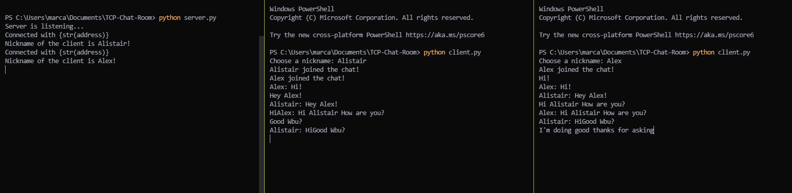

# TCP-Chat-Room
A Chat Room made with python 🐍

When the server is running, any client can connect to the room, identify themselves with a username and chat!

Here is a small picture showing how the chat room works:

